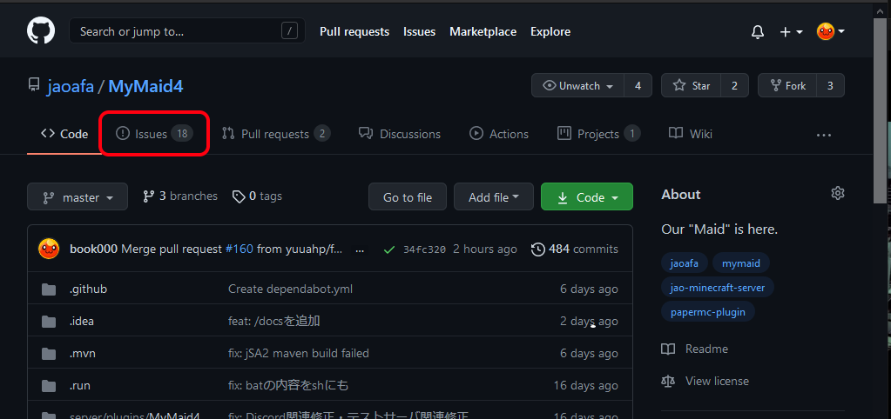
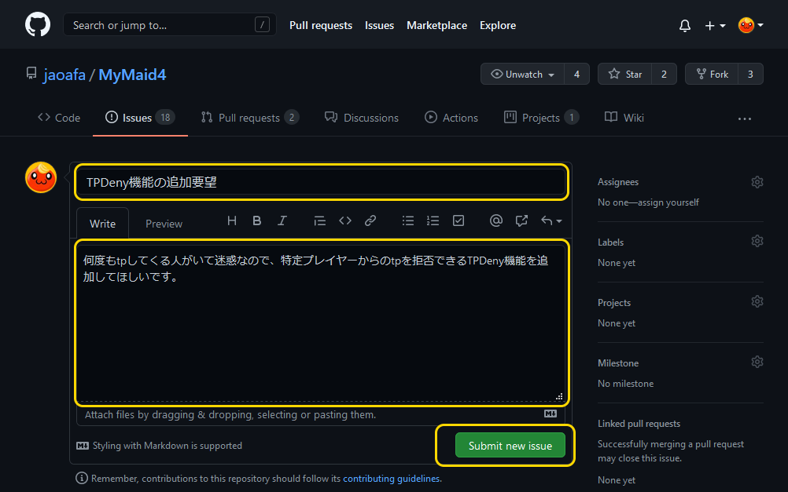
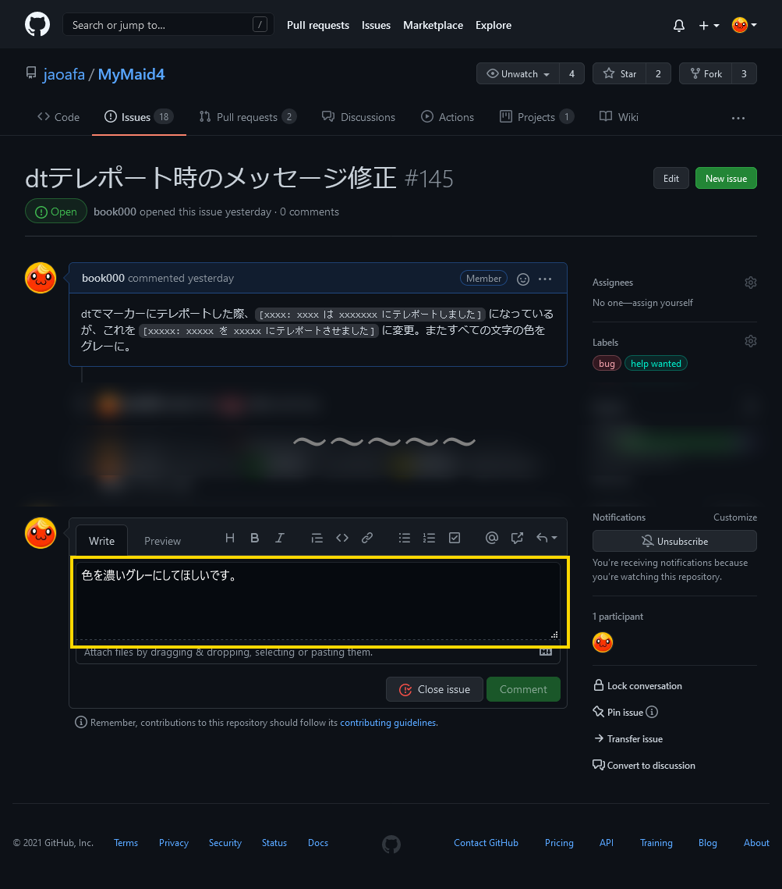

# Issue

## Issueの作り方

ここでは、 `jaoafa/MyMaid4` リポジトリへ「TPDeny機能を作ってほしい」という要望を送るとして解説します。

MyMaid4以外のリポジトリは以下の通りです。

- [jaoafa/jaoweb](https://github.com/jaoafa/jaoweb): `jaoafa.com` Webサイトのリポジトリ
- [jaoafa/jaoweb-docs](https://github.com/jaoafa/jaoweb-docs): `jaoafa.com` Webサイトの記事リポジトリ
- [jaoafa/jMS-Resource-Pack](https://github.com/jaoafa/jMS-Resource-Pack): Minecraftサーバリソースパックのリポジトリ
- [jaoafa/JDA-VCSpeaker](https://github.com/jaoafa/JDA-VCSpeaker): `#vc` の読み上げをする `VCSpeaker` のリポジトリ

## 1. リポジトリのページにアクセスし、Issue一覧ページを開きます

[`jaoafa/MyMaid4`のリポジトリページ](https://github.com/jaoafa/MyMaid4) にアクセスし、ナビゲーションバーの `Issues` をクリックします。

## 2. 送ろうとしているIssueと同じ/似たものがないか確認してください

現在オープンなIssueの一覧が表示されます。同じか似た項目がないかどうか確認してください。

## 3. 右上の New issue をクリックし、issueを作成します

Issueページの右上あたりに `New issue` という緑色のボタンがあります。これをクリックしてください。  
そうすると、Issueの作成ページが開きます。

`Title` に簡単なバグ報告・要望のタイトル、`Leave a comment` に具体的に説明した内容を記入してください。  
`Leave a comment` ではMarkdown記法が使え、また画像などもアップロードできます。

確認後、 緑色のボタン `Submit new issue` でissueを投稿してください。

## Issueにコメントをつける

ここでは、 `jaoafa/MyMaid4` リポジトリの [dtテレポート時のメッセージ修正](https://github.com/jaoafa/MyMaid4/issues/145) というissueに対して「色を濃いグレーにしてほしい」というコメントを残すとして解説します。

## 1. リポジトリのページにアクセスし、Issue一覧ページを開きます

[`jaoafa/MyMaid4`のリポジトリページ](https://github.com/jaoafa/MyMaid4) にアクセスし、ナビゲーションバーの `Issues` をクリックします。

## 2. コメントを残すissueを探し、開いてください

コメントを残すissueを一覧から探し、issueタイトルをクリックして開いてください。

## 3. コメントを書き、投稿してください

issueを作成するときと同様に、`Leave a comment` に残すコメントを入力して、緑のボタン `Comment` をクリックしてください。
